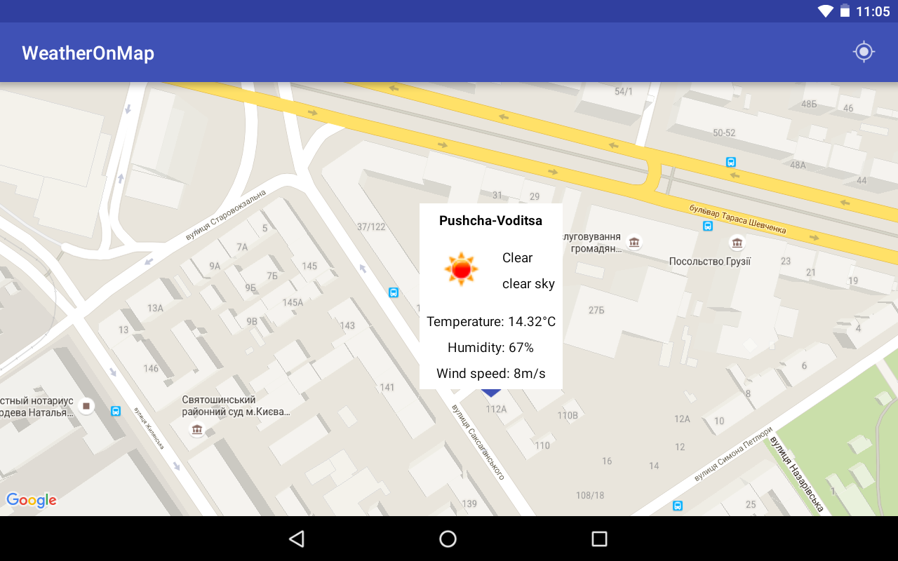

# WeatherOnMap Android app.

Task
==========
Need to create application which will show weather for specified location.

Main screen should be a Google map, onClick popup will appear with weather info (with icon) for selected location. Here is the example on how it should look like. 
UI can be as simple as possible.

WeatherAPI should be used from here: http://openweathermap.org/api

It should use tools:
databinding https://developer.android.com/topic/libraries/data-binding/index.html
rxjava https://github.com/ReactiveX/RxJava
retrofit http://square.github.io/retrofit/
glide https://github.com/bumptech/glide

Must use MVP pattern.

My solution screenshot
==========

